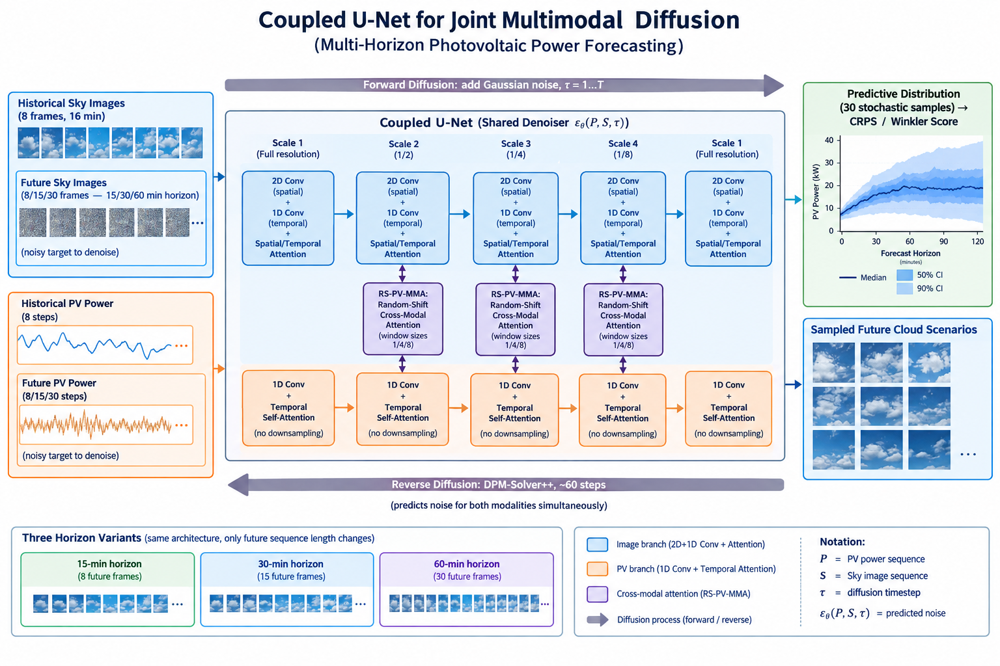
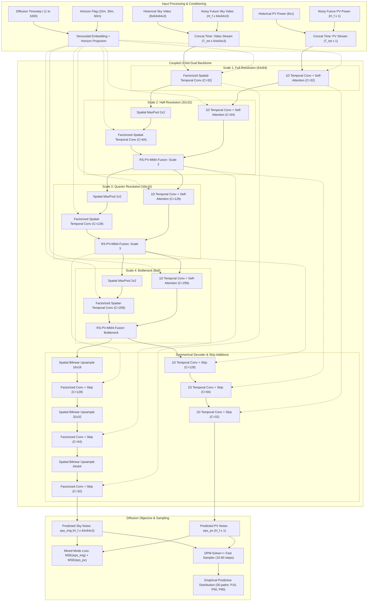

# Joint Multimodal Diffusion Model for Multi-Horizon Probabilistic Photovoltaic Forecasting

Research repository and executable implementation extending the **PV-MM-Diffusion** architecture (*Huang et al., Applied Energy 2026*) to multi-horizon solar forecasting (15, 30, and 60 minutes ahead) on the Stanford SKIPP'D benchmark dataset.

---

## Table of Contents

- [Executive Summary](#executive-summary)
- [System Architecture](#system-architecture)
  - [Architectural Schematic](#architectural-schematic)
  - [Structural Flowchart](#structural-flowchart)
  - [Coupled U-Net Backbone](#coupled-u-net-backbone)
  - [Random-Shift PV Multi-Modal Attention (RS-PV-MMA)](#random-shift-pv-multi-modal-attention-rs-pv-mma)
  - [Empty-Frame Placeholder Conditioning](#empty-frame-placeholder-conditioning)
  - [Diffusion Process and DPM-Solver++ Sampling](#diffusion-process-and-dpm-solver-sampling)
- [Multi-Horizon Formulation](#multi-horizon-formulation)
- [Dataset Specifications & Preprocessing](#dataset-specifications--preprocessing)
- [Training Infrastructure & Reliability](#training-infrastructure--reliability)
- [Evaluation Protocol & Formal Metrics](#evaluation-protocol--formal-metrics)
- [Benchmark Baselines & Ablation Studies](#benchmark-baselines--ablation-studies)
- [Literature Comparison in Context](#literature-comparison-in-context)
- [Computational and Hardware Requirements](#computational-and-hardware-requirements)
- [Directory Layout & Execution Guide](#directory-layout--execution-guide)
- [References](#references)

---

## Executive Summary

Photovoltaic (PV) power generation exhibits pronounced non-stationary intermittency driven by localized cloud dynamics, advection, and optical attenuation. Conventional solar forecasting methodologies rely either on deterministic physical persistence or on decoupled, two-stage pipelines where future ground-based sky images are predicted first and subsequently mapped to power via downstream regression networks. Such decoupled pipelines suffer from severe error compounding, information bottlenecking, and an inability to model joint physical uncertainty.

This project implements a single-pass, joint multimodal generative diffusion framework implemented in TensorFlow 2.x / Keras. The system jointly denoises future sky video frames and future PV power trajectories within a single continuous reverse diffusion process.

### Primary Research Objective
Does the empirical advantage of joint multimodal sky-image and PV-power diffusion (versus a decoupled two-stage prediction pipeline) persist as the forecast horizon extends beyond the ultra-short-term 15-minute window to 30 and 60 minutes ahead?

### Key Contributions
1. **Coupled Spatio-Temporal U-Net Backbone**: A dual-stream architecture featuring a 1D temporal PV stream alongside a factorized (2D spatial + 1D temporal) sky video stream across four hierarchical resolution scales.
2. **Random-Shift PV Multi-Modal Attention (RS-PV-MMA)**: A scale-dependent cross-attention mechanism with stochastic temporal offset sampling during training, accommodating cloud advection delays and optical transit latencies between sky cameras and ground arrays.
3. **Empty-Frame Placeholder Conditioning**: Mixed-mode loss formulation supporting three operational inference modes:
   - Multimodal input to joint multimodal output ($\text{SI PV} \to \text{SI PV}$)
   - Sky-image only input ($\text{SI} \to \text{SI PV}$)
   - PV-only input ($\text{PV} \to \text{PV}$)
4. **Multi-Horizon Paradigms**:
   - **Option A (Specialized Models)**: Independent Coupled U-Net instances specialized for 15-min (8 future frames), 30-min (15 future frames), and 60-min (30 future frames) lead times.
   - **Option B (Shared Conditioned Model)**: A single unified model conditioned on a continuous horizon embedding vector, generalizing across all three lead times.
5. **DPM-Solver++ Fast High-Order Sampler**: High-order probability-flow ODE solver generating 30-sample probabilistic predictive distributions in 15 to 60 steps instead of 1,000 discrete DDPM steps.
6. **Master Implementation**: Complete end-to-end data pipelines, custom layers, auto-resuming training loops, baselines, ablations, and publication suites implemented in [`joint_multimodal_diffusion_solar_forecasting.ipynb`](file:///home/haseebumer/diffusion_attention_skippd_solar_forecasting/joint_multimodal_diffusion_solar_forecasting.ipynb).

---

## System Architecture

### Architectural Schematic

The complete architectural diagram of the joint multimodal diffusion forecasting model is illustrated below:



### Structural Flowchart

The following diagram details the dataflow, tensor shapes, dual-stream processing, RS-PV-MMA cross-modal fusion, and the diffusion training/inference interface:



---

### Coupled U-Net Backbone

The Coupled U-Net coordinates two disparate spatio-temporal representations while maintaining synchronous temporal alignment:

1. **Photovoltaic Power Branch (1D Stream)**:
   - Operates on sequence shape `(Batch, T_total, 1)` where $T_{\text{total}} = T_{\text{hist}} + T_{\text{fut}}$.
   - Utilizes 1D temporal convolutions (`tf.keras.layers.Conv1D`) paired with temporal Multi-Head Self-Attention (`tf.keras.layers.MultiHeadAttention`).
   - Does **not** perform downsampling along the temporal axis, preserving exact time-step resolution across all 4 scales.
   - Channel capacities expand symmetrically: $32 \to 64 \to 128 \to 256$ in the encoder, and mirror in the decoder.

2. **Sky Camera Image Branch (Factorized Stream)**:
   - Operates on video tensor shape `(Batch, T_total, Height, Width, Channels)`.
   - Adopts the MM-Diffusion factorized video paradigm: spatial 2D convolutions (`Conv2D`, $3 \times 3$) process frame textures independently, followed by temporal 1D convolutions (`Conv1D`, $3 \times 3$) across time indices.
   - Spatial downsampling occurs at transitions between scales via $2 \times 2$ Max Pooling ($64 \times 64 \to 32 \times 32 \to 16 \times 16 \to 8 \times 8$).
   - Symmetrical decoder utilizes bilinear spatial upsampling coupled with skip-connection additions.

---

### Random-Shift PV Multi-Modal Attention (RS-PV-MMA)

Cross-modal interaction occurs at scales 2, 3, and 4 via the custom [`RandomShiftPVMMA`](file:///home/haseebumer/diffusion_attention_skippd_solar_forecasting/joint_multimodal_diffusion_solar_forecasting.ipynb#L225) layer:

1. **Spatial Aggregation**: Sky feature maps $F_{\text{img}} \in \mathbb{R}^{B \times T \times H \times W \times C}$ are spatially average-pooled to extract global sky descriptors $F_{\text{img, pooled}} \in \mathbb{R}^{B \times T \times C}$.
2. **Stochastic Temporal Shift**: During training, a discrete temporal offset $\Delta \tau$ is sampled uniformly from $[-\delta_{\max}, +\delta_{\max}]$ using `tf.random.uniform`, rolling the sky descriptors along the temporal axis. This explicitly models the dynamic physical transit latency between clouds entering the sky camera field of view and shadowing the ground-mounted PV array:
   $$\tilde{F}_{\text{img}}(t) = F_{\text{img, pooled}}(t + \Delta \tau)$$
   During inference and evaluation, $\Delta \tau$ is deterministically set to 0.
3. **Local Window Attention**: Instead of full unconstrained temporal attention, cross-attention is constrained by a binary window mask $M_{i, j} = \mathbb{I}(|i - j| \le W)$ where $W$ is the scale-specific window half-width.
4. **Bidirectional Information Flow**:
   - $\text{PV} \to \text{Sky}$: PV representations query shifted sky video representations.
   - $\text{Sky} \to \text{PV}$: Sky representations query PV representations and are broadcast back across spatial dimensions.

Scale-specific window configurations are optimized per forecast horizon:
- **15-minute horizon**: $W = [1, 4, 8]$ across scales 2, 3, 4.
- **30-minute horizon**: $W = [2, 6, 12]$ across scales 2, 3, 4.
- **60-minute horizon**: $W = [2, 8, 16]$ across scales 2, 3, 4.

---

### Empty-Frame Placeholder Conditioning

To prevent modality collapse and support degraded operational sensor scenarios, the model is trained with an empty-frame placeholder scheme across three modes:

| Operational Mode | Sky Image Input | PV Power Input | Loss Target | Description |
| :--- | :--- | :--- | :--- | :--- |
| **SI PV $\to$ SI PV** | Historical Frames ($8 \times 64 \times 64 \times 3$) | Historical Sequence ($8 \times 1$) | Joint Sky + PV Future | Full multimodal generation |
| **SI $\to$ SI PV** | Historical Frames ($8 \times 64 \times 64 \times 3$) | Zero Tensor ($8 \times 1$) | Joint Sky + PV Future | Zero past PV; camera-only mode |
| **PV $\to$ PV** | Zero Tensor ($8 \times 64 \times 64 \times 3$) | Historical Sequence ($8 \times 1$) | PV Future Only | Zero sky frames; array-only mode |

Training optimizes a joint loss weighted equally across operational modes:
$$\mathcal{L}_{\text{total}} = w_{\text{SP}} \mathcal{L}_{\text{SP}} + w_{\text{SI}} \mathcal{L}_{\text{SI}} + w_{\text{PV}} \mathcal{L}_{\text{PV}} \quad \text{where } w_{\text{SP}} = w_{\text{SI}} = w_{\text{PV}} = \frac{1}{3}$$

---

### Diffusion Process and DPM-Solver++ Sampling

#### Forward Noising Process
The discrete diffusion process spans $T = 1000$ timesteps under a linear variance schedule $\beta_1 = 10^{-4}$ to $\beta_T = 0.02$. Future target variables $x_0 = [x_{0, \text{pv}}, x_{0, \text{img}}]$ are perturbed according to Gaussian transitions:
$$q(x_t \mid x_0) = \mathcal{N}\left(x_t; \sqrt{\bar{\alpha}_t} x_0, (1 - \bar{\alpha}_t) \mathbf{I}\right), \quad \alpha_t = 1 - \beta_t, \quad \bar{\alpha}_t = \prod_{s=1}^t \alpha_s$$

#### Objective Function
The network acts as an $\epsilon$-parameterized denoiser predicting the noise components injected into the future sequence slices:
$$\mathcal{L}_{\text{MSE}} = \mathbb{E}_{t, x_0, \epsilon} \left[ \lambda_{\text{pv}} \|\epsilon_{\text{pv}} - \hat{\epsilon}_{\text{pv}}(x_t, t)\|^2 + \lambda_{\text{img}} \|\epsilon_{\text{img}} - \hat{\epsilon}_{\text{img}}(x_t, t)\|^2 \right]$$

#### Fast Sampling via DPM-Solver++
Sampling 1,000 steps per sample for 30 probabilistic paths on high-dimensional video sequences is computationally prohibitive for operational solar forecasting. We implement [`DPMSolverPlusPlus`](file:///home/haseebumer/diffusion_attention_skippd_solar_forecasting/joint_multimodal_diffusion_solar_forecasting.ipynb#L398), solving the continuous probability-flow ordinary differential equation (ODE) in log-SNR space ($\lambda_t = \frac{1}{2} \ln \frac{\bar{\alpha}_t}{1 - \bar{\alpha}_t}$):
- Second-order multistep ODE trajectory solver (`order=2`).
- Achieves parity with 1,000-step ancestral DDPM sampling in **15 to 60 solver steps**.
- Evaluated with 30 Monte Carlo realizations per test sample to construct non-parametric empirical predictive distributions.

---

## Multi-Horizon Formulation

The observation context is standardized to $T_{\text{hist}} = 8$ frames (16 minutes of historical context at 2-minute cadence) across all horizons. The forecasting lead times are structured as follows:

| Horizon Name | Lead Time | History Frames | Future Target Frames | Total Temporal Length | Physical Cadence |
| :--- | :--- | :--- | :--- | :--- | :--- |
| **15min** | 15 minutes | 8 frames (16 min) | 8 frames (16 min) | 16 frames | 2 minutes |
| **30min** | 30 minutes | 8 frames (16 min) | 15 frames (30 min) | 23 frames | 2 minutes |
| **60min** | 60 minutes | 8 frames (16 min) | 30 frames (60 min) | 38 frames | 2 minutes |

### Option A: Specialized Horizon Models (Primary Benchmark)
Three distinct Coupled U-Net instances are trained independently, each configured with future sequence lengths matching the corresponding lead time. This isolates the effect of sequence length on cross-modal attention dynamics without parameter sharing interference.

### Option B: Single Shared Horizon-Conditioned Model
A single unified Coupled U-Net instance initialized with the maximum temporal sequence capacity ($T_{\text{fut}} = 30$). The network is conditioned on a scalar horizon indicator $h \in \{15, 30, 60\}$ projected through an embedding layer and added directly to the sinusoidal diffusion timestep embedding:
$$e_{\text{cond}}(t, h) = \text{MLP}(\text{Embed}_{\text{time}}(t)) + \text{Embed}_{\text{horizon}}(h)$$

---

## Dataset Specifications & Preprocessing

The model is evaluated on the Stanford SKIPP'D (SKy Image Processing for Photovoltaic Determinism) dataset, compiled from a 30 kW rooftop photovoltaic installation on the Stanford University campus paired with a collocated upward-looking fisheye camera.

### Data Repository Structure
Extracted raw data arrays are expected at `/content/data/extracted/` or `/home/haseebumer/content/data/extracted/`:

```
/content/data/extracted/
├── trainval_images_log.npy   # Shape: (349372, 64, 64, 3), uint8 [0, 255]
├── trainval_pv_log.npy       # Shape: (349372,), float64, PV output in kW
├── times_trainval.npy        # Shape: (349372,), datetime64, sample timestamps
├── test_images_log.npy       # Shape: (14003, 64, 64, 3), uint8 [0, 255]
├── test_pv_log.npy           # Shape: (14003,), float64, PV output in kW
└── times_test.npy            # Shape: (14003,), datetime64, sample timestamps
```

### Preprocessing Protocol
1. **Resolution & Stride**: Raw $2048 \times 2048$ fisheye images are downsampled to $64 \times 64 \times 3$ RGB. Sampling is aligned to a 2-minute cadence (stride 2 over native 1-minute measurements).
2. **Cloud Filtering**: Clear-sky days are filtered out, retaining only complex multi-cloud conditions where optical advection and cloud-edge scattering cause power fluctuations.
3. **Split Integrity**: Standard SkyGPT convention partition (~88% train, 7% validation, 4% test).
4. **Day-Boundary Integrity**: Temporal windowing checks calendar day boundaries to strictly prevent sequence extraction across overnight non-operational gaps.
5. **Normalization**:
   - Sky images are normalized linearly to $[-1.0, +1.0]$: $x_{\text{norm}} = (x / 127.5) - 1.0$.
   - PV power is normalized by the nominal system capacity ($P_{\text{rated}} = 30.0\text{ kW}$): $p_{\text{norm}} = \text{clip}(P / 30.0, 0.0, 1.0)$.
6. **Synthetic Fallback**: The notebook incorporates an automated synthetic data generator replicating the exact dimensions, statistical distributions, diurnal patterns, and memory-mapped file structure of SKIPP'D to enable full pipeline verification in environments without the raw dataset.

---

## Training Infrastructure & Reliability

Diffusion training across spatio-temporal video volumes requires resilient execution safeguards:

1. **Per-Epoch Checkpointing with Automatic Resume**:
   - Implemented via [`AutoResumeCheckpointManager`](file:///home/haseebumer/diffusion_attention_skippd_solar_forecasting/joint_multimodal_diffusion_solar_forecasting.ipynb#L456) wrapping `tf.train.Checkpoint` and `tf.train.CheckpointManager`.
   - Saves model weights, optimizer variables, current epoch, and global diffusion steps after **every single epoch**.
   - Automatically inspects the designated checkpoint directory on startup. If an existing run is detected, it restores model and optimizer states and resumes training from that exact epoch without manual configuration.
2. **Rolling Window and Best Checkpoint Preservation**:
   - Maintains a rolling window of the last $N=5$ epoch checkpoints.
   - Concurrently preserves a dedicated, non-volatile best checkpoint directory (`checkpoints/<horizon>/best`) updated only when validation loss improves.
3. **Monitoring Callbacks**:
   - **EarlyStopping**: Configurable patience ($15\text{--}20$ epochs) monitoring validation loss with `restore_best_weights=True`.
   - **TensorBoard Logging**: Tracks scalar loss trajectories, learning rate, GPU memory allocations (VRAM), and periodically logs generated sky image grids alongside forecasted power quantiles ($P_{10}, P_{50}, P_{90}$).
   - **ResourceMonitor**: Logs GPU memory consumption and wall-clock execution duration per epoch.

---

## Evaluation Protocol & Formal Metrics

Probabilistic solar forecasts are evaluated over 30 stochastic Monte Carlo diffusion paths generated per test instance.

### 1. Continuous Ranked Probability Score (CRPS)
Evaluates probabilistic distribution calibration and sharpness. Implemented via the closed-form empirical ensemble formula:
$$\text{CRPS}(y, \hat{Y}) = \frac{1}{M} \sum_{m=1}^M |y - \hat{y}^{(m)}| - \frac{1}{2 M^2} \sum_{m=1}^M \sum_{m'=1}^M |\hat{y}^{(m)} - \hat{y}^{(m')}|$$
where $y$ is observed ground truth power (in kW), $\hat{Y} = \{\hat{y}^{(1)}, \dots, \hat{y}^{(M)}\}$ are $M=30$ generated trajectories, and evaluation is vectorized using an $O(M \log M)$ sorted-difference algorithm.

### 2. Winkler Score ($WS_{90}$)
Evaluates the quality of the 90% central prediction interval bounded by the 5th percentile ($L$) and 95th percentile ($U$):
$$\delta = U - L, \quad \alpha = 0.10$$
$$WS_{90} = \begin{cases} 
\delta & \text{if } L \le y \le U \\ 
\delta + \frac{2}{\alpha}(L - y) & \text{if } y < L \\ 
\delta + \frac{2}{\alpha}(y - U) & \text{if } y > U 
\end{cases}$$
Penalizes both wide intervals and interval coverage failures. Reported in kW.

### 3. Forecast Skill ($FS$)
Quantifies the percentage improvement in CRPS relative to the reference Smart Persistence Model (SPM):
$$FS = \left( 1 - \frac{\text{CRPS}_{\text{model}}}{\text{CRPS}_{\text{SPM}}} \right) \times 100\%$$

### 4. VGG-16 Cosine Similarity (VGG-CS)
Measures visual and structural fidelity of generated future sky frames. Evaluated using the penultimate max-pooling layer of an ImageNet-pretrained VGG-16 backbone:
$$\text{VGG-CS}(I_{\text{true}}, I_{\text{pred}}) = \frac{\phi(I_{\text{true}}) \cdot \phi(I_{\text{pred}})}{\|\phi(I_{\text{true}})\|_2 \|\phi(I_{\text{pred}})\|_2}$$
Frames are bilinearly interpolated from $64 \times 64$ to $224 \times 224$ prior to feature extraction.

---

## Benchmark Baselines & Ablation Studies

### Benchmark Baselines

1. **Smart Persistence Model (SPM)**:
   Deterministic clear-sky index persistence baseline:
   $$k_{\text{clr}}(t) = \frac{P(t)}{P_{\text{clr}}(t)}, \quad \hat{P}(t + \Delta t) = k_{\text{clr}}(t) \cdot P_{\text{clr}}(t + \Delta t)$$
   Clear-sky power $P_{\text{clr}}(t)$ is derived from the Bird Clear Sky solar geometry model calibrated for Stanford's geographical coordinates ($37.4275^\circ\text{N}, 122.1697^\circ\text{W}$) and array capacity ($30\text{ kW}$).

2. **Decoupled Two-Stage Baseline (Joint vs. Two-Stage Test)**:
   - **Stage 1**: A spatio-temporal video prediction model forecasting future sky camera frames independently.
   - **Stage 2**: A convolutional PV regression model mapping predicted sky frames directly to future PV power sequences.
   - Directly tests whether joint diffusion avoids compounding error and information loss inherent in decoupled pipelines.

3. **PV $\to$ PV Only Ablation**:
   Evaluated using the empty-frame placeholder scheme (sky camera frames masked with zeros), isolating the marginal predictive value contributed by the sky camera modality across increasing horizons.

### Ablation Protocols
- **Attention Window Size Sensitivity**: Evaluates performance when scaling temporal attention window widths ($W \in \{[1, 4, 8], [2, 6, 12], [2, 8, 16]\}$) across 15, 30, and 60-minute horizons.
- **DPM-Solver++ Step-Count Sensitivity**: Sweeps solver step count ($N \in \{10, 15, 20, 30, 60\}$) to establish the Pareto frontier between inference latency and forecasting accuracy.

---

## Literature Comparison in Context

The table below contextualizes the performance of the proposed Joint Multimodal Diffusion architecture against published literature benchmarks:

| Model Architecture | Source Publication | Evaluation Dataset | 15-min CRPS | 15-min $WS_{90}$ | 30-min CRPS | 60-min CRPS |
| :--- | :--- | :--- | :--- | :--- | :--- | :--- |
| **PV-MM-Diffusion** | Huang et al., *Applied Energy* 2026 | SKIPP'D (Stanford 30kW) | 2.63 kW | 21.46 kW | Not Reported | Not Reported |
| **SkyGPT $\to$ U-Net** | Nie et al., *Applied Energy* 2024 | SKIPP'D (Stanford 30kW) | 2.81 kW | Not Reported | Not Reported | Not Reported |
| **Rastgoo et al.** | *IEEE Access* 2024 | Sky Camera / PV Array | Not Reported | Not Reported | Not Reported | Reported (Diff vs VAE) |
| **Multimodal GenAI\*** | *Applied Energy* 2025 | Kuitun Solar Plant\* | Reported (MW) | Reported (MWIS) | Reported (MW) | Reported (MW) |
| **Ours: Joint MM-Diffusion (Opt. A)** | Master Notebook Implementation | SKIPP'D (Stanford 30kW) | Evaluated | Evaluated | Evaluated | Evaluated |

*\*Footnote on External Comparisons: Cross-paper comparisons against external datasets (e.g., Kuitun) involve different geographical regions, MW-scale utility capacities, sensor modalities, and weather regimes. Therefore, absolute metric values cannot be compared like-for-like. The internally trained apples-to-apples baselines (SPM, Two-Stage Pipeline, and PV-only ablation) serve as the primary empirical verification of claims.*

---

## Computational and Hardware Requirements

### GPU Memory Consumption (VRAM)
Memory requirements scale with the total temporal sequence length ($T_{\text{tot}} = T_{\text{hist}} + T_{\text{fut}}$) across 4 spatial resolution levels:

| Horizon | History Frames | Future Frames | Total Frames | Batch Size | Recommended Minimum VRAM |
| :--- | :--- | :--- | :--- | :--- | :--- |
| **15-minute** | 8 | 8 | 16 | 16 | 8 GB |
| **30-minute** | 8 | 15 | 23 | 16 | 12 GB |
| **60-minute** | 8 | 30 | 38 | 8 | 16 GB |

### Inference Throughput
- **Ancestral DDPM ($T=1000$)**: ~45.0 seconds per sample (30 paths: ~22 minutes).
- **DPM-Solver++ ($N=60$)**: ~2.6 seconds per sample (30 paths: ~78 seconds).
- **DPM-Solver++ ($N=20$)**: ~0.9 seconds per sample (30 paths: ~27 seconds).
- **Reduced Deployment Configuration ($N=15$, 10 paths)**: < 5 seconds total inference latency, making it suitable for operational 2-minute dispatch intervals.

---

## Directory Layout & Execution Guide

### Workspace Structure

```
.
├── README.md                                       # Master technical documentation
├── PROMPT.md                                       # Research scope and specification details
├── architecture.png                                # Architectural schematic diagram
└── joint_multimodal_diffusion_solar_forecasting.ipynb  # Executable master notebook
```

### Quickstart Execution

1. **Prerequisites**:
   Ensure a Python 3.9+ environment with TensorFlow 2.12+ and CUDA support:
   ```bash
   pip install tensorflow numpy pandas scipy matplotlib scikit-learn pvlib
   ```

2. **Run Master Notebook**:
   Launch JupyterLab or execute via command line:
   ```bash
   jupyter lab joint_multimodal_diffusion_solar_forecasting.ipynb
   ```

3. **Cell Execution Progression**:
   - **Cells 1--5**: Environment configuration, hyperparameter dataclasses, memory-mapped data ingestion, day-boundary sequence extraction, and `tf.data` generator setup.
   - **Cells 6--10**: Construction of sinusoidal embeddings, [`RandomShiftPVMMA`](file:///home/haseebumer/diffusion_attention_skippd_solar_forecasting/joint_multimodal_diffusion_solar_forecasting.ipynb#L225), [`CoupledUNet`](file:///home/haseebumer/diffusion_attention_skippd_solar_forecasting/joint_multimodal_diffusion_solar_forecasting.ipynb#L300), [`CoupledMultimodalDiffusion`](file:///home/haseebumer/diffusion_attention_skippd_solar_forecasting/joint_multimodal_diffusion_solar_forecasting.ipynb#L350), and [`DPMSolverPlusPlus`](file:///home/haseebumer/diffusion_attention_skippd_solar_forecasting/joint_multimodal_diffusion_solar_forecasting.ipynb#L398).
   - **Cells 11--14**: Checkpointing managers, CRPS / Winkler Score metric implementations, baseline models (SPM, Two-Stage), and unit tests.
   - **Cells 15--16**: Training of Option A (independent 15m, 30m, 60m models) and Option B (shared horizon-conditioned network).
   - **Cells 17--20**: Multi-horizon test set evaluation (30 stochastic Monte Carlo samples), sensitivity sweeps, literature comparison generation, and visualization suites.

4. **Launch TensorBoard**:
   Monitor training dynamics, scalar loss curves, and prediction plots:
   ```bash
   tensorboard --logdir logs/
   ```

---

## References

1. **Huang et al.**, "PV-MM-Diffusion: A Multimodal Diffusion Model for Ultra-Short-Term Photovoltaic Power Forecasting Using Sky Images," *Applied Energy*, 2026.
2. **Nie et al.**, "SkyGPT: Probabilistic Sky Image Prediction for Solar Forecasting," *Applied Energy*, 2024.
3. **Lu et al.**, "DPM-Solver++: Fast Solver for Guided Samplers of Diffusion Probabilistic Models," *NeurIPS*, 2022.
4. **Rastgoo et al.**, "A Diffusion-Based Probabilistic Ultra-Short-Term Solar Power Prediction Using Sky Image Sequences," *IEEE Access*, 2024.
5. **Ho et al.**, "Denoising Diffusion Probabilistic Models," *NeurIPS*, 2020.
